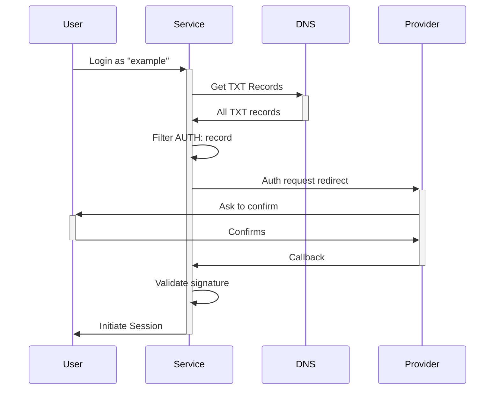

# HIP-0003 : Authentication using Handshake name

```
Number:  HIP-0003
Title:   Authentication using Handshake name
Type:    Informational
Status:  Final
Authors: Fernando Falci <falci>
Created: 2020-10-25
```

## Abstract

This HIP describe how to authenticate a user using their Handshake name.

## Motivation

Many websites need to identify the user and prove they own a Handshake name. Other websites simply need to identify users, which forces the user to enter a process of picking a unique username that most of the time can't be consistent across different apps. Using Handshake names as usernames allows both to happen: prove ownership of a name and have a consistent username across unrelated apps.

## Protocol Overview

The basics of this protocol consist of a public and private ECDSA key. The domain exposes the public key via DNS record.
The Service that wants to authenticate the user should provide this user with a unique challenge.
The User signs the challenge using their private key and returns it to the Service, among the public key and the domain name.
The Service then confirms the challenge is correctly signed. The Service also validates if the domain name indeed exposes the public key.

### Provider

The above-mentioned flow requires an extra piece of software: a user-trusted provider. This provider knows/holds the user's private key. It can run on the client-side, as a browser extension or an installed app; or it can run remotely as a regular web service.
This provider will respond to the request with the signed challenge sent by the Service.

The domain should also have a DNS record to define the URL of its Provider.

Assuming that the community will provide different solutions and implementation options, the User will choose one Provider and register it to respond to the custom protocol.

It is outside the context of this HIP to define how the Provider interacts with the User or how the public/private keys should be generated.

This also means that, once the User chooses a Provider and is onboarded, the User won't be able to switch to another provider without replacing its public key. In other words: the User cannot authenticate itself with any Provider, but only with the Provider they used to generate the public key.

### Exposing the public key and provider URL

The public key and Provider URL should be exposed via DNS TXT record.
The record should have the following format: `AUTH:<public key>:<provider url>`
Example: `AUTH:04e57a5d7f2a3b3c5d6e7f8a9b0c1d2e3f4a5b6c7d8e9f00112233445566778899aabbccddeeff00112233445566778899aabbccddeeff:https://example.com`

Note: the Provider URL could have a custom protocol, or trigger a deep-link to a browser extension or another software running locally (like a wallet)

### Authentication request

Any Service can create an authentication request. It should send the user to the Provider URL (`GET` request) defining the Challenge and the Callback URL: `<Provider URL>?challenge=<Challenge>&callback=<Callback>`.

| Key          | Type        | Options                                                                                                                          |
| ------------ | ----------- | -------------------------------------------------------------------------------------------------------------------------------- |
| Provider URL | DNS         | Based on DNS record.                                                                                                             |
| challenge    | querystring | A 32-characters long string. Hex.                                                                                                |
| callback     | querystring | An encoded callback URL. It will be (async) called by the provider with the challenge response. It must be a secure URL (HTTPS). |

Example:
`https://example.com?challenge=446bcbfd1b0cae7ae75e8afc33b35a5a&callback=https%3A%2F%2Fservice.com%2Fcallback%3Fsession%3DABC

### Authentication response

It's a Provider's decision on how to identify and authenticate the User.

Once the Provider identifies the User, it can sign the challenge using the User's private key and call the Service using the provided callback URL in a GET request.

The following query string should be appended to the callback URL:

| Key       | Options                                     |
| --------- | ------------------------------------------- |
| domain    | The domain name that will identify the User |
| challenge | The same challenge sent by the Service      |
| signature | The signed challenge                        |

Example: `https://service.com/callback?session=ABC&domain=example&challenge=446bcbfd1b0cae7ae75e8afc33b35a5a&signature=3045022100a3b5c7d9e8f123456789abcdefabcdefabcdefabcdefabcdefabcdefabcdefabcde02207f8e9d6c4b3a2f1e0d9c8b7a6f5e4d3c2b1a0987654321fedcba9876543210f`

### Handling a response

When the Service is called via its callback URL, it should:

1. Retrieve the TXT DNS record prefixed with `AUTH:` and from that extract the public key.
2. Verify the challenge is identical from the request.
3. Verify the signature is valid (using the public key from step 1).
   The Service should reject the authentication request if any of the above fails.

Note: there's no point in adding the public key in the response from the Provider to the Service since it won't be trusted.

Once all verifications are complete, the Service can use the `domain` to identify the current User.

### Diagram



## Consideration

This proposal does not force the domain name to be a TLD. Users could authenticate themselves with `support.example` for instance.

Additionally, there's no need to be strict with a Handshake domain name. Users could authenticate themselves with `example.com`.
